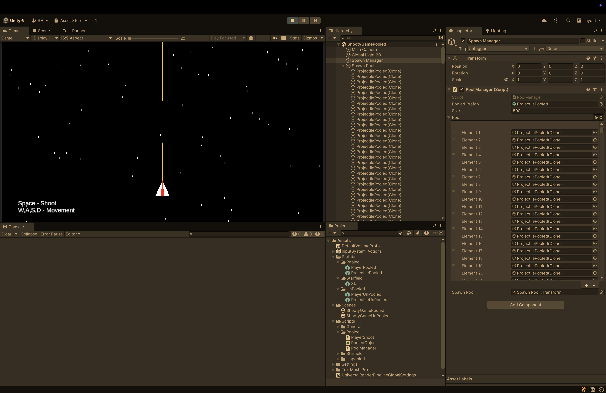

# Unity Object Pooling Example

This repository contains a Unity project demonstrating the implementation of an object pooling pattern. Object pooling is a performance optimization technique used in game development (and other applications) to efficiently manage frequently instantiated and destroyed objects, reducing the overhead of memory allocation and garbage collection.



## Lecture Slides

For a more in-depth explanation of the object pooling pattern and the concepts demonstrated in this project, you can refer to the lecture slides:

[Object Pooling - Unity Workshop.pdf](Object%20Pooling%20-%20Unity%20Workshop.pdf)

## Why Object Pooling?

In Unity, creating new `GameObject` instances and destroying them can be expensive, especially when done frequently, such as with bullets, enemies, or visual effects. Each time an object is instantiated, Unity allocates memory for it, and when it's destroyed, the garbage collector eventually reclaims that memory. Frequent allocations and deallocations can lead to performance spikes and hitches, especially on mobile devices or in games with many dynamic elements.

Object pooling addresses this by:

1.  **Pre-instantiating objects:** Instead of creating new objects on demand, a pool of objects is created at the start (or when needed) and kept in memory.
2.  **Reusing objects:** When an object is "needed," it's taken from the pool, activated, and used. When it's "no longer needed," it's not destroyed but rather deactivated and returned to the pool, ready to be reused.
3.  **Reducing garbage collection:** By reusing objects instead of constantly creating and destroying them, the amount of garbage generated is significantly reduced, leading to smoother performance.

## Project Structure

The project is a standard Unity project. The core logic for the object pooling pattern can typically be found in scripts related to:

*   **`PoolManager.cs`**: A centralized script that manages multiple object pools.
*   **`PooledObject.cs`**: A script attached to objects that can be pooled, often containing methods for "activating" and "deactivating" the object.
*   **`PlayerShoot.cs`**: An example script demonstrating how to request objects from the `PoolManager` and return them.

## How to Use This Project

1.  **Clone the repository:**
    ```bash
    git clone https://github.com/robrab2000/ObjectPoolingExampleProject.git
    ```

2.  **Open in Unity:** Open the cloned project in the Unity Editor (this project was created with Unity 6.1).

3.  **Explore the scenes:** Navigate to the `Assets/Scenes` folder. You will find two scenes:
    *   `ShootyGamePooled.unity`: Demonstrates the game with object pooling implemented.
    *   `ShootyGameUnPooled.unity`: Demonstrates the game *without* object pooling, allowing for a direct comparison of performance.

4.  **Run the project:** Play either scene to see the projectile spawning in action. To observe the performance benefits directly, run both scenes and monitor the "Profiler" window in Unity, comparing the "GC Allocations" (as shown in the lecture slides).

## Further Reading

To deepen your understanding of object pooling and related performance concepts, consider these resources:

*   **Object Pooling Pattern Overview:**
    *   [Game Programming Patterns: Object Pool](https://gameprogrammingpatterns.com/object-pool.html) - A classic resource providing a comprehensive overview of the pattern.

*   **Data Structures for Object Pooling:**
    *   Choosing the right data structure (like `List`, `Queue`, `Stack`, or `HashSet`) for your pool can impact performance. Each has different trade-offs in terms of insertion, deletion, and access times. For a general overview of C# collections:
        *   [Microsoft Docs: Collections in C#](https://learn.microsoft.com/en-us/dotnet/csharp/programming-guide/concepts/collections)
        * 
*   **Garbage Collection in Unity/C#:**
    *   Understanding how Unity's garbage collector works is crucial for writing performant C# code.
    *   [Unity Documentation: Understanding automatic memory management](https://docs.unity3d.com/Packages/com.unity.memoryprofiler@0.1/manual/workflow-understanding-memory.html) (See "Automatic Memory Management")
    *   [Microsoft Docs: Fundamentals of garbage collection](https://learn.microsoft.com/en-us/dotnet/standard/garbage-collection/fundamentals)

*   **Memory Fragmentation:**
    *   This occurs when free memory is broken into small, non-contiguous blocks, even if there's enough total free memory. It can lead to failed allocations or increased GC work.
    *   [Wikipedia: Memory fragmentation](https://en.wikipedia.org/wiki/Fragmentation_(computing)) (See "Memory Fragmentation")

---

Feel free to explore the code, experiment with the settings, and adapt the object pooling pattern for your own Unity projects!
